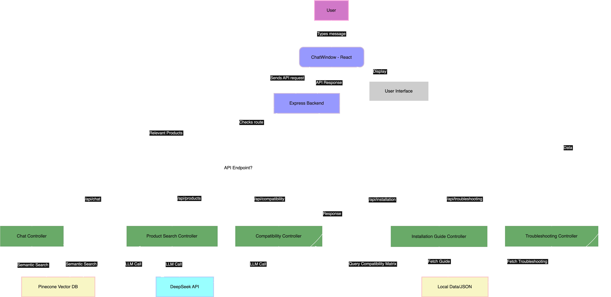

# PartSelect Chat Assistant - Instalily AI Case Study


**Developer: Bob Tianqi Wei**  
**Date: June 2025**

A React-based chat assistant for PartSelect e-commerce website, specializing in refrigerator and dishwasher parts. Features DeepSeek AI integration, product search, compatibility checks, installation guides, and troubleshooting support.

## 🎥 Demo Video

https://youtu.be/WIz0ok_3UnQ


## 🚀 Core Features

- **AI-Powered Chat**: DeepSeek language model integration for intelligent responses
- **Product Search**: Search for refrigerator and dishwasher parts by number or description
- **Compatibility Checks**: Verify part compatibility with appliance models
- **Installation Guides**: Step-by-step installation instructions with visual guides
- **Troubleshooting Support**: Common appliance issue solutions
- **Modern UI/UX**: Responsive React interface with real-time chat
- **Vector Database**: Semantic search using Pinecone (optional)

## 🛠️ Technology Stack

- **Frontend**: React.js, CSS3
- **Backend**: Node.js, Express.js
- **AI**: DeepSeek API
- **Vector Database**: Pinecone (optional)
- **Images**: SVG graphics for products and installation guides

## 📁 Project Structure


*System architecture flowchart of the PartSelect Chat Agent*


```
ChatAgent_PartSelect/
├── src/
│   ├── components/
│   │   ├── ChatWindow.js          # Main chat interface
│   │   ├── ProductCard.js         # Product display component
│   │   └── CompatibilityChecker.js # Compatibility verification
│   ├── data/
│   │   └── sampleProducts.js      # Sample product database
│   ├── services/
│   │   └── vectorDB.js            # Vector database service
│   └── api/
│       └── api.js                 # API client
├── public/
│   └── images/products/           # Product images and installation guides
├── server.js                      # Express backend server
├── config.js                      # API configuration
└── package.json
```

## 🔧 Installation & Setup

### Prerequisites
- Node.js (v14 or higher)
- npm package manager
- DeepSeek API key
- Pinecone API key (optional)

### Quick Start

1. **Clone and install**
   ```bash
   git clone https://github.com/bobtianqiwei/ChatAgent_PartSelect.git
   cd ChatAgent_PartSelect
   npm install
   ```

2. **Configure API keys**
   
   Copy `config.example.js` to `config.js`:
   ```bash
   cp config.example.js config.js
   ```
   
   Update `config.js` with your API keys:
   ```javascript
   module.exports = {
     DEEPSEEK_API_KEY: 'your-deepseek-api-key-here',
     DEEPSEEK_API_URL: 'https://api.deepseek.com/v1/chat/completions',
     PINECONE_API_KEY: 'your-pinecone-api-key-here', // Optional
     PORT: 3001,
     NODE_ENV: 'development'
   };
   ```

3. **Start the application**

   Start the backend server:
   ```bash
   node server.js
   ```
   
   Start the frontend (in a new terminal):
   ```bash
   npm start
   ```
   
   The application will be available at:
   - Frontend: http://localhost:3000
   - Backend API: http://localhost:3001

## 📚 API Endpoints

### Core Endpoints
- `POST /api/chat` - Send chat messages to AI
- `GET /api/products` - Search products
- `GET /api/compatibility/:partNumber` - Check part compatibility
- `GET /api/installation/:partNumber` - Get installation guide
- `GET /api/troubleshooting` - Get troubleshooting help

### Vector Database Endpoints
- `GET /api/semantic-search?query=<search_term>&limit=<number>` - Semantic search
- `GET /api/products/enhanced?query=<search_term>&category=<category>` - Enhanced product search

## 🧪 Testing

Run the test cases in `test-cases.md` to verify functionality:

1. **Example Queries** (Instalily Requirements):
   - "How can I install part number PS11752778?"
   - "Is this part compatible with my WDT780SAEM1 model?"
   - "The ice maker on my Whirlpool fridge is not working. How can I fix it?"

2. **Feature Testing**:
   - Basic chat functionality
   - Product search and compatibility checks
   - Installation guides and troubleshooting
   - Responsive design on mobile/desktop

## 🗄️ Vector Database Setup (Optional)

### Pinecone Setup
1. Sign up at [Pinecone](https://www.pinecone.io/)
2. Create a new project and get your API key
3. Add the key to `config.js`
4. Restart the server - the system will automatically create the index

### Fallback Mode
If no vector database is configured, the system automatically falls back to keyword-based search.

## 🔍 Usage Examples

```
User: "I need a water filter for my refrigerator"
AI: "I can help you find a water filter. What's your refrigerator model?"

User: "How can I install part number PS11752778?"
AI: [Provides detailed installation guide with steps and tools]

User: "Is this part compatible with my WDT780SAEM1 model?"
AI: [Shows compatibility results with product recommendations]
```

## 📖 Documentation

- **Technical Documentation**: See `TECHNICAL_DOCS.md` for detailed architecture and implementation
- **Test Cases**: See `test-cases.md` for comprehensive testing scenarios
- **Project Summary**: See `PROJECT_SUMMARY.md` for project overview and achievements

## 🤝 Contributing

This is a case study project by Bob Tianqi Wei for Instalily AI.

## 📄 License

This project is created for educational and demonstration purposes.

---

**Developer: Bob Tianqi Wei**  
**Project: Instalily AI Case Study**  
**Date: June 2025**
